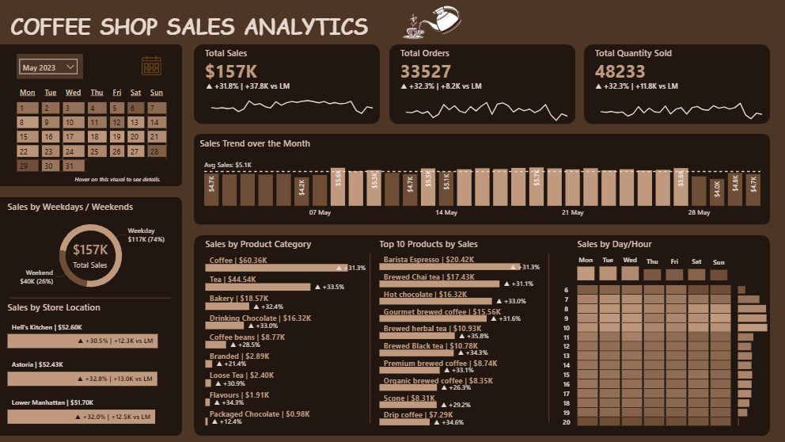

# ☕ Coffee Shop Sales Analysis

## 📌 Project Overview
This project analyzes transactional sales data from a coffee shop chain to uncover key business insights related to revenue trends, customer behavior, product performance, and store-level efficiency.

The analysis is performed using SQL and Power BI and focuses on deriving actionable insights that can support decision-making in operations, marketing, and inventory planning.

---

## 🎯 Objectives
- Evaluate overall business performance using key KPIs
- Analyze time-based sales trends (monthly, daily, hourly)
- Identify top and underperforming products
- Compare store-level performance and growth trends
- Understand customer purchasing patterns (weekdays vs weekends)

---

## 🗂 Dataset Description
The dataset contains transactional-level data with the following fields:

- `transaction_id` – Unique identifier for each transaction  
- `transaction_date`, `transaction_time` – Date and time of purchase  
- `transaction_qty` – Quantity sold  
- `unit_price` – Price per unit  
- `store_id`, `store_location` – Store details  
- `product_id`, `product_category`, `product_type`, `product_detail` – Product hierarchy  
The dataset spans January 1, 2023 to June 30, 2023, covering the first two quarters (Q1–Q2) of 2023.
---

## 📈 Key Metrics
- **Total Revenue**
- **Total Orders**
- **Total Quantity Sold**
- **Average Order Value (AOV)**
- **Month-over-Month (MoM) Growth**

---

## 🔍 Analysis Performed

### 1. Data Exploration
- Dataset structure and schema validation  
- Date range and coverage  
- Unique stores and product hierarchy  

### 2. KPI Overview
- Total revenue, orders, and quantity sold  
- Average order value  
- Product count  

### 3. Time-Based Analysis
- Monthly sales trend with MoM growth  
- Daily average sales per month  
- Hourly sales distribution  
- Day-of-week performance  
- Weekday vs weekend comparison  

### 4. Product Performance
- Top 10 products by revenue  
- Bottom 10 products (underperformers)  
- Category-level revenue contribution  

### 5. Store Performance
- Store-wise revenue contribution  
- Month-over-month growth per store  

---

## 📊 Key Insights
- Peak sales occur during morning hours → staffing optimization opportunity  
- A small set of product category contributes majority of revenue → concentration risk  
- Weekdays show uniform revenue distribution.  
- Stores show high variation in MoM growth → operational investigation needed  

---

## 📊 Dashboard Preview

## ⚙️ How to View the Dashboard

1. Download the `Coffee Sales Analysis Dashboard.pbix` file
2. Open in Power BI Desktop
3. Data is pre-loaded (Import Mode), no setup required

## 🗂 Data Source

- Original Source: MySQL database
- Mode: Import (data embedded in PBIX)
- Dataset also provided as CSV for reference

---

## 🛠 Tools & Technologies
- **SQL (MySQL)** – Data analysis  
- **Power BI & DAX** – Data visualization
- **MS Word** - Query Report 

---

## 📌 Business Impact
This analysis can help:
- Optimize staffing schedules based on peak hours  
- Improve product mix and discontinue low-performing items  
- Design targeted promotions for specific days/ products
- Benchmark store performance and identify growth opportunities  

---

## 🚀 Future Enhancements
- Customer segmentation 
- Basket analysis (market basket / cross-sell insights)  
- Forecasting sales trends  
- Inventory optimization integration  

---

## 📂 Project Structure

    ├── README.md          <- README for this project.
    ├── dataset              
        │
        └── Coffee Shop Sales CSV.csv  <- data used for this project

    ├── sql queries              <- DB creation and analysis queries.
    │   │
    │   └── 01_ddl_script.sql       <- DB and table creation.
    │   └── 02_analysis_queries.sql   <- Analysis queries.

    ├── dashboard_and_report    <- Folder containing the power bi dashboard file and query report.
        │
        └── Coffee Sales Analysis Dashboard.pbix  <- Power BI dashboard file.
        └── Query_Report_pdf.pdf         <- Final query report in PDF for verifying data.
        └── dashboard_preview.png        <- Preview image for the dashboard.
  
    

---